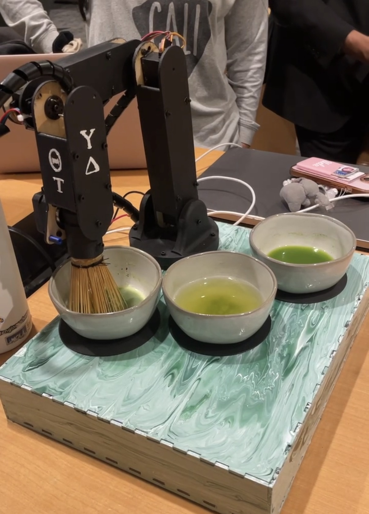

# Robotic Matcha Whisking Machine

A 3-jointed robotic arm designed to automate the traditional Japanese matcha whisking process, blending robotics, IoT, and cultural mindfulness into an interactive experience.

## 🧠 Overview

This project explores how robotics can capture the artistry of traditional tea preparation through precision motion control and responsive feedback. The system simulates hand-whisking techniques to achieve authentic froth and texture using servo-driven kinematics.

---

## ⚙️ Features

- **3 Degrees of Freedom**: Base rotation (360°), main arm elevation (180°), and whisk oscillation for realistic motion
- **Arduino WiFi Uno Control**: Runs motion sequences and enables real-time communication
- **React Dashboard**: Built with React for intuitive control and live visualization of whisking states
- **IoT Connectivity**: Remote command interface using the Adafruit_PWMServoDriver library for smooth, synchronous motion
- **Demonstration Mode**: Preprogrammed whisking patterns optimized for speed and foam texture

---

## 🧩 Tech Stack

| Component     | Technology                                              |
| ------------- | ------------------------------------------------------- |
| Hardware      | Arduino WiFi Uno, 3 SG90 Servo Motors, Custom Arm Mount |
| Software      | C++ (Arduino), React.js                                 |
| Libraries     | Adafruit_PWMServoDriver, Axios                          |
| Communication | Serial over Wi-Fi                                       |
| Design        | 3D-printed arm components and laser-cut acrylic base    |

---

## 🧪 How It Works

1. **Input Control** — User adjusts whisking speed and duration via the React dashboard
2. **Signal Processing** — Commands are sent to the Arduino through Wi-Fi
3. **Servo Actuation** — The base, main arm, and whisk motors execute synchronized motions
4. **Feedback Loop** — System can be calibrated to maintain consistency across batches

---

## ☁️ Inspiration

Inspired by _chanoyu_ (the Japanese tea ceremony), this project bridges modern automation with traditional craftsmanship—transforming the act of whisking into both a cultural and engineering showcase.

---
